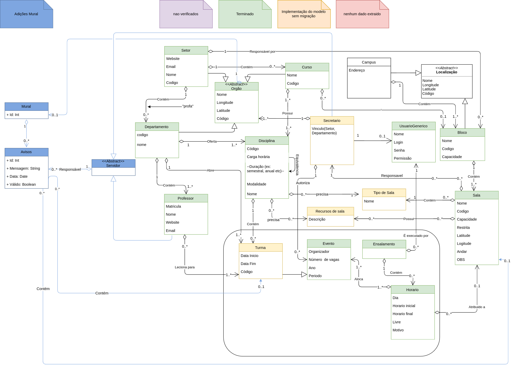

# Trabalho 2 Projeto de Software (CI163)
Extensão da API do [sistema ensalador](https://gitlab.c3sl.ufpr.br/ensalamento/ensalamento). Foi implementado um conjunto de classes para um Mural de Informações.

## Alunas
### Stephanie Briere Americo
GRR20165313
### Talita Halboth Cunha Fernandes
GRR20165399

## Diagrama UML da extensão

O diagrama UML do ensalador já existente foi extendido com as novas classes e novos relacionamentos do mural.

## Classes

### Mural

A classe mural foi definida no arquivo [mural.json](ensalamento-back/common/models/mural.json). 
O mural tem uma relação de agregamento com a classe abstrata órgão, que é herdada pelas classes [Setor](ensalamento-back/common/models/setor.json), [Departamento](ensalamento-back/common/models/departamento.json) e [Curso](ensalamento-back/common/models/curso.json). O tipo de relação entre o Mural e os Órgãos usado foi "`belongsTo`", enquanto o de cada órgão com o mural é "`hasOne`". Só é possível haver um mural atrelado à um órgão, por isso o atributo "`orgaoId`" é required.
O mural também tem uma relação de agregação com a classe aviso [Aviso](ensalamento-back/common/models/aviso.js). O tipo de relação entre o Mural e os Avisos é "`hasMany`".

### Aviso

A classe aviso foi definida no arquivo [aviso.json](ensalamento-back/common/models/aviso.json).
Os avisos têm, obrigatoriamente, uma mensagem, uma data (que é adquirida com o atributo "`now`"), informação que indica se a mensagem é ou não válida, um responsável e são sempre atrlados a um mural. Opcionalmente, os avisos podem estar atrelados a uma sala e/ou a uma turma. 
O tipo da relação entre os avisos e o mural é de "`belongsTo`".
O responsável pelo aviso é um Servidor, que é uma classe abstrata, e [Professor](ensalamento-back/common/models/professor.json) e [Secretário](ensalamento-back/common/models/secretario.json) ambos herdam desta classe. 
O aviso tem uma relação de agrgação com a classe Servidor, e uma associação simples com [Turma](ensalamento-back/common/models/turma.json) e [Sala](ensalamento-back/common/models/sala.json). O tipo de relação entre o aviso e todas estas classes é "`belongsTo`".
Já estas classes têm uma relação de tipo "`hasMany`" com a classe aviso.